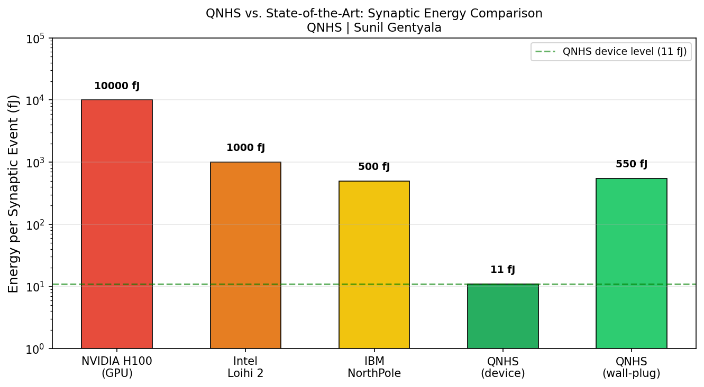
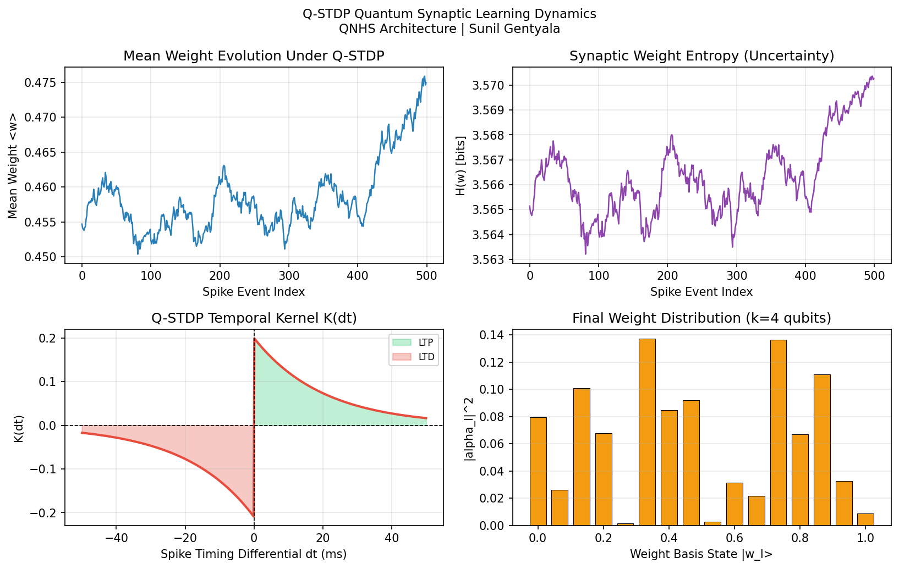
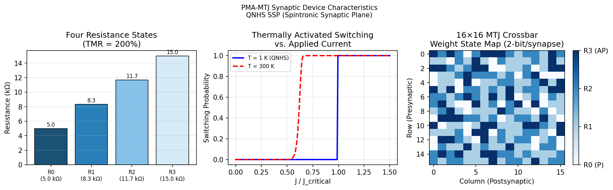
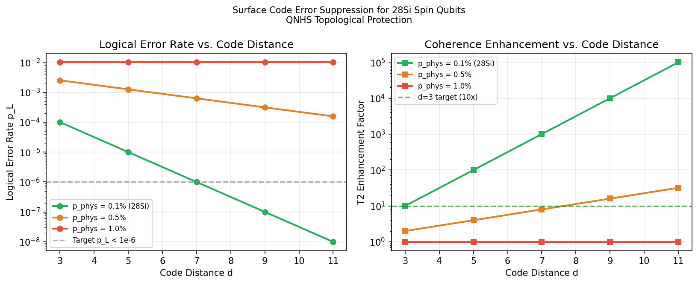

<div align="center">

# QNHS: Quantum-Neuromorphic Hybrid Substrate

### Open models for a nanoscale spin-qubit + spintronic + cryo-CMOS neuromorphic substrate, and an honest check of whether it can work

[](https://github.com/sunilgentyala/QNHS-Research-2026/actions/workflows/ci.yml)
[](https://github.com/sunilgentyala/QNHS-Research-2026/releases)
[](tests/results/test_results.txt)
[](requirements.txt)
[](LICENSE)
[](https://sunilgentyala.github.io/QNHS-Research-2026/)
[](https://orcid.org/0009-0005-2642-3479)
[](https://doi.org/10.5281/zenodo.22942967)

**[Website](https://sunilgentyala.github.io/QNHS-Research-2026/)** ·
**[Quick Start](#quick-start)** ·
**[Results](#results)** ·
**[Threat Model](security/threat_model.md)** ·
**[Cite](#citation)**

</div>

---

Simulation code, unit tests, references and a hardware security threat model for **QNHS**, a proposed
monolithic three-plane architecture that stacks spin qubits, spintronic synapses and cryo-CMOS
control into one device. The code computes the energy, learning, device and error-correction numbers
so they can be checked rather than taken on trust, including the numbers that count against the idea.

> All QNHS figures are **theoretical projections** from the models in this repository, not measurements
> of fabricated hardware.

## At a glance

| | |
|---|---|
| **~11.1 fJ** | modeled energy per synaptic event (device level) |
| **≥3.3 pJ** | wall-plug energy per event once the Carnot cost of cooling 1 K to 300 K is charged (only ~3x under a 10 pJ GPU reference, even with an ideal refrigerator) |
| **33%** | refrigerator efficiency (fraction of Carnot) needed just to break even with the GPU reference |
| **2^k states** | weight distribution per synapse with k qubits (16 states for k = 4) |
| **~2 µs** | coherence demonstrated for silicon qubits above 1 K (Yang et al., Nature 2020), versus a 10 ms spike window: the main open gap |
| **102 / 102** | unit tests passing |

## Architecture

```
          ┌─────────────────────────────────────────────┐
 Plane 1  │  QCPP  Quantum Coherent Processing Plane    │  28Si spin qubit arrays, d=3 surface code
          ├──────────────── Cu-Cu bond, 200 nm pitch ───┤
 Plane 2  │  SSP   Spintronic Synaptic Plane            │  PMA-MTJ memristors, 4 states (2 bit)
          ├──────────────── Cu-Cu bond, 200 nm pitch ───┤
 Plane 3  │  CPP   CMOS Peripheral Plane                │  3 nm cryo-CMOS FinFET: LIF neurons, MWPM decoder
          └─────────────────────────────────────────────┘
                              operated at ~1 K
```

## Key contributions

1. **Three-plane monolithic architecture.** Quantum, spintronic and CMOS planes joined by hybrid bonding (200 nm pitch is a design target).
2. **Quantum synaptic encoding.** Each synapse is a k-qubit state in a 2^k-dimensional Hilbert space, so the weight is a distribution with built-in Bayesian uncertainty.
3. **Q-STDP learning rule.** Spike-timing-dependent plasticity in the amplitude domain. LTP moves probability mass toward higher-weight basis states and LTD moves it toward lower ones.
4. **Error-correction and coherence budget.** d = 3 gives a 10x gain at 0.1% physical error but none at the ~1% error rates measured above 1 K, so holding amplitudes for a 10 ms spike window is out of reach today.
5. **Energy model with cooling.** 11.1 fJ per event at the device, at least 3.3 pJ at the wall plug once the Carnot cost of 1 K operation is charged.
6. **Hardware security analysis.** Side-channel, learning-rule poisoning, Trojan and supply-chain threats, plus candidate primitives (quantum-dot PUFs, MTJ random-number generation).

## Quick start

```bash
git clone https://github.com/sunilgentyala/QNHS-Research-2026.git
cd QNHS-Research-2026
pip install -r requirements.txt

python run_all_simulations.py     # all four models + tests + figures/*.png
python -m pytest tests/ -v        # 102 unit tests
```

Each model also runs on its own, from any directory:

```bash
python simulations/energy_model.py
python simulations/qstdp_simulation.py
python simulations/mtj_resistance_model.py
python simulations/surface_code_analysis.py
```

## Results

### 1. Energy per synaptic event



| Component | Value | Basis |
|-----------|------:|-------|
| E_MTJ | 0.10 fJ | SOT switching, 20 nm PMA-MTJ, 1 ns pulse |
| E_qubit | 0.99 fJ | 30 nW gate drive, 33 ns pi-pulse (30 MHz Rabi) |
| E_CMOS | 10.0 fJ | LIF neuron + MWPM + SerDes, 3 nm FinFET at 1 K |
| **E_syn** | **11.09 fJ** | **sum; roughly 900x below the ~10 pJ H100 figure** |

### 2. Q-STDP learning dynamics



```
alpha_l(t+1) = N[ alpha_l(t) + eta * K(dt) * (w_l - <w>) * alpha_l(t) ]
K(dt)        = A+ exp(-dt/tau+) Theta(dt)  -  A- exp(dt/tau-) Theta(-dt)
```

Under sustained potentiation (dt = +15 ms, 200 events) the mean weight rises from 0.40 to 0.59.
Under sustained depression (dt = -15 ms) it falls to 0.25.

### 3. PMA-MTJ synaptic device



Four resistance states (5.0 / 8.3 / 11.7 / 15.0 kΩ) encode 2 bits per synapse, with TMR = 200% and a 60 k_B T retention barrier.

### 4. Surface code error suppression



`p_L = p_phys (p_phys / p_th)^((d-1)/2)`. At p_phys = 0.1% and d = 3 this gives p_L = 1e-4 and a 10x coherence gain.
The 1 µs MWPM decoder cycle fits 10,000 times into a 10 ms spike window.

### 5. Extended experiments

`python run_extended_experiments.py` (about 8 minutes) writes every number below to
[`results/extended_results.json`](results/extended_results.json).

| Study | Module | Main result |
|-------|--------|-------------|
| Re-preparation under noise | `reprep_noise.py` | Density-matrix simulation of the 29-gate (k = 4) loading circuit. With the original pessimistic ~1.5 K model the sampled distribution is off by TVD 0.19, but the mean weight by only 0.017. With the 1 K fidelities of Huang et al. (Nature 2024), mapped to channel parameters, TVD falls to 0.066 (k = 4) and 0.024 (k = 2). Gate and readout errors, not T2, set the floor. |
| Network learning | `network_learning.py` | 20-input LIF neuron, 5 seeds, 200 s, eight synapse models. Q-STDP learns input correlations (selectivity 0.39 to 0.41) with or without 1 K noise, including the 1 K (Huang) case (0.395); weight entropy drops from 3.4 to 1.7 bits only on learned synapses. Classical weight-dependent baselines (multiplicative, van Rossum) are included: van Rossum STDP reaches 0.49 and stays more selective than Q-STDP at every drive tested, so Q-STDP has no stability advantage. A learning-rate sweep shows that the high-drive collapse of additive STDP is partly rate dependent. |
| Energy uncertainty | `energy_uncertainty.py` | 200,000 Monte Carlo samples. QNHS beats a 10 pJ GPU reference in 2.5% of samples in hold mode and in none in re-preparation mode (67 fJ per event at the point values, since v1.4.0 charges CNOTs their 100 ns); refrigerator efficiency dominates (Spearman 0.81 to 0.82). |
| Poisoning | `poisoning.py` | A 5% share of attacker-timed spikes moves the mean weight 0.46 to 0.61. Update clipping removes about 60% of the shift; a binomial timing test detects it with 98% probability in 1,000 pairs. |
| Shared sampling pool | `sampling_pool.py` | Re-preparation registers are transient, so a pool of time-multiplexed engines can serve all synapses. Erlang C sizing (P(wait) < 1%): 161 four-qubit engines (644 qubits) serve a 256x256 crossbar at 10 Hz with the measured ~0.2 ms 1 K event time, versus 262,144 dedicated qubits. |
| Coherent hold | `coherent_hold.py` | The Q-STDP update is nonlinear in the state, so no quantum channel implements it. With the mean supplied classically, an ancilla filter (16 Ry + 16 CNOT for k = 4, 2.1 us) succeeds with probability >= 0.986 at c = 0.01. |
| Workload energy | `energy_uncertainty.py` | Separates sampling energy (67 fJ, re-preparation) from learning-update energy (12 pJ, bounded by 7 nm arithmetic and the measured Loihi update). Learning is 99.6% of device energy. Against measured Loihi energy the design never wins with the update logic at 1 K and wins in 17% of samples with it at 300 K. |
| MTJ TRNG at 1 K | `mtj_trng.py` | Holding P(switch) = 0.50 +/- 0.01 needs a current window of 2.3e-5 (relative) at 1 K vs 1.7e-3 at 300 K, 72x tighter. |

The ranges and assumptions behind each study are listed in the module docstrings.

### Comparison

| Metric | NVIDIA H100 | Intel Loihi 2 | IBM NorthPole | QNHS (projected) |
|--------|-------------|---------------|---------------|------------------|
| Energy evidence | ~10 pJ/event (reference) | measured chips | 25x FPS/W vs 12 nm GPU | **11.1 fJ device, ≥3.3 pJ wall-plug** |
| Weight encoding | FP16 | INT8 | INT8 | **2^k quantum states** |
| Bayesian uncertainty | None | None | None | **Intrinsic** |
| Spike-native | No | Yes | Partial | **Yes** |
| Security primitives | None | None | None | **PUF, TRNG (proposed)** |
| Operating temperature | 300 K | 300 K | 300 K | **~1 K** |

The QNHS wall-plug figure charges the Carnot minimum of 299 J of work per joule removed at 1 K. Real refrigerators do worse, which raises the cost further (see `refrigeration_overhead(fraction_of_carnot=...)`).

## Repository structure

```
QNHS-Research-2026/
├── run_all_simulations.py       # one-command runner: models, tests, figures
├── run_extended_experiments.py  # noise, network, Monte Carlo, poisoning, TRNG studies
├── simulations/
│   ├── energy_model.py          # synaptic energy decomposition
│   ├── qstdp_simulation.py      # Q-STDP amplitude learning
│   ├── mtj_resistance_model.py  # PMA-MTJ four-state model
│   └── surface_code_analysis.py # distance-d surface code coherence
├── tests/                       # 102 unit tests + results/ snapshots
├── results/extended_results.json
├── references/references.bib    # 15 references, each checked against Crossref
├── security/threat_model.md     # hardware security threat model
├── docs/                        # GitHub Pages website
└── figures/                     # generated by the runner (git-ignored)
```

## Security

The threat model covers:

- **Side channels.** Lu et al. (GLSVLSI 2025, [10.1145/3716368.3735264](https://doi.org/10.1145/3716368.3735264)) fingerprinted cloud quantum hardware in 10 queries. Choudhury et al. (NDSS 2025, [10.14722/ndss.2025.242185](https://doi.org/10.14722/ndss.2025.242185)) used crosstalk to identify a victim's quantum algorithm with up to 85.7% accuracy.
- **Adversarial weights.** Projective sampling makes inference stochastic, but stochastic defenses can be bypassed by gradient averaging, so no robustness is claimed without evaluation. Q-STDP opens a training-time poisoning channel; update clipping and spike-statistics monitoring are candidate defenses.
- **Primitives.** Quantum-dot PUFs from charge-noise signatures and MTJ random-number generation (thermal switching is strongly suppressed at 1 K, so this needs near-critical biasing or low-barrier cells). Crossbar acceleration of lattice PQC is a research direction only: ML-KEM needs exact mod-3329 arithmetic that 2-bit analog cells cannot supply directly.
- **Supply chain.** Trusted-foundry flow and post-fabrication verification at 1 K for cryo-CMOS logic locking.

Full document: [security/threat_model.md](security/threat_model.md)

## Citation

```bibtex
@software{gentyala2026qnhs,
  author = {Gentyala, Sunil},
  title  = {{QNHS}: Quantum-Neuromorphic Hybrid Substrate simulation suite},
  year      = {2026},
  publisher = {Zenodo},
  doi       = {10.5281/zenodo.22942967},
  url       = {https://github.com/sunilgentyala/QNHS-Research-2026}
}
```

The DOI is the Zenodo concept DOI (all versions). A companion manuscript is in preparation and is not yet citable.

GitHub's **"Cite this repository"** button reads [CITATION.cff](CITATION.cff).

## Author

**Sunil Gentyala**, IEEE Senior Member
Independent Researcher, HCLTech (HCL America Inc.), Dallas, TX, USA
[sunil.gentyala@ieee.org](mailto:sunil.gentyala@ieee.org) ·
[ORCID](https://orcid.org/0009-0005-2642-3479) ·
[LinkedIn](https://www.linkedin.com/in/sunil-gentyala) ·
[GitHub](https://github.com/sunilgentyala)

## License

MIT. See [LICENSE](LICENSE).
